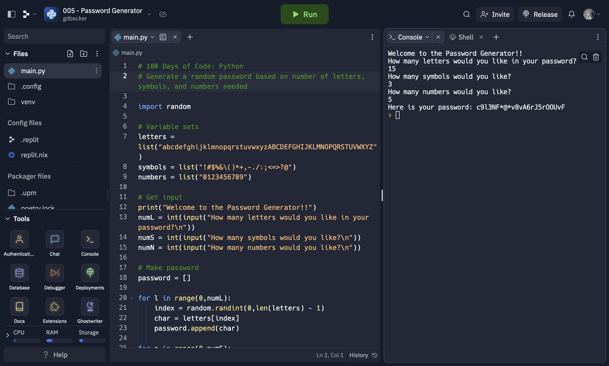

# 005 - Password Generator

Generate a random password based on number of letters, symbols, and numbers needed

### Project Type

Scripting

### Demo View

### Links

- [Live Demo](https://replit.com/@gdbecker/005-Password-Generator)

### Tools & Packages

- [Python](https://www.python.org)
- random
- [VS Code](https://code.visualstudio.com)

### Skills Used

- Print statements
- User input
- For loops
- Integer casting
- f strings

## Author

- Website - [Garrett Becker]()
- Replit - [@gdbecker](https://replit.com/@gdbecker)
- LinkedIn - [Garrett Becker](https://www.linkedin.com/in/garrett-becker-923b4a106/)