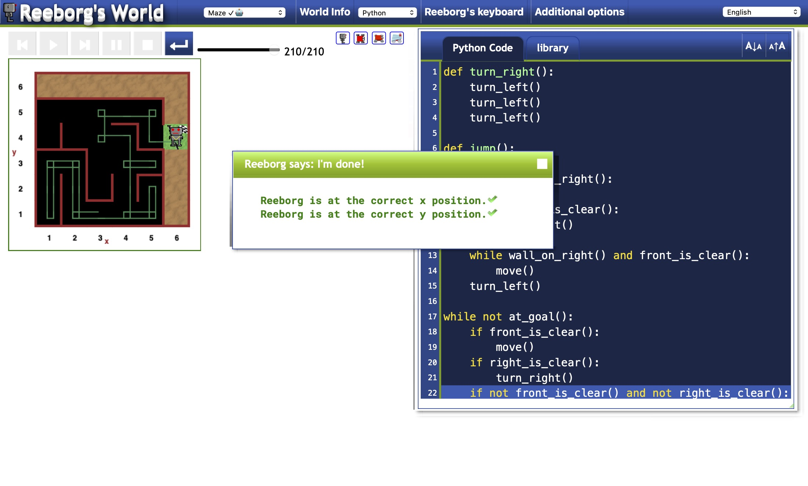

# 006 - Escape Maze Problem

Solution to a [Reeborg World Maze problem](https://reeborg.ca/reeborg.html?lang=en&mode=python&menu=worlds%2Fmenus%2Freeborg_intro_en.json&name=Maze&url=worlds%2Ftutorial_en%2Fmaze1.json)

### Project Type

Scripting

### Demo View

### Links

- [Live Demo](https://replit.com/@gdbecker/006-Escape-Maze-Problem)

### Tools & Packages

- [Python](https://www.python.org)
- [VS Code](https://code.visualstudio.com)

### Skills Used

- While loops
- Methods
- If statements

## Author

- Website - [Garrett Becker]()
- Replit - [@gdbecker](https://replit.com/@gdbecker)
- LinkedIn - [Garrett Becker](https://www.linkedin.com/in/garrett-becker-923b4a106/)