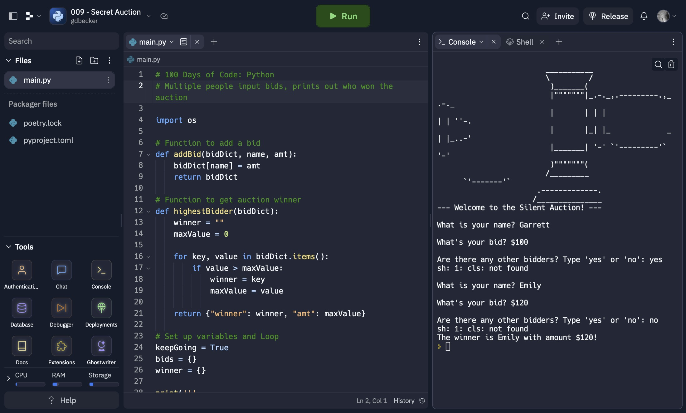

# 009 - Secret Auction

Multiple people input bids, and the program prints out who won the auction

### Project Type

Scripting

### Demo View

### Links

- [Live Demo](https://replit.com/@gdbecker/009-Secret-Auction)

### Tools & Packages

- [Python](https://www.python.org)
- os
- [VS Code](https://code.visualstudio.com)

### Skills Used

- Print statements
- User input
- For loops
- While loops
- Methods
- If statements
- f strings
- Dictionaries
- Integer casting

## Author

- Website - [Garrett Becker]()
- Replit - [@gdbecker](https://replit.com/@gdbecker)
- LinkedIn - [Garrett Becker](https://www.linkedin.com/in/garrett-becker-923b4a106/)