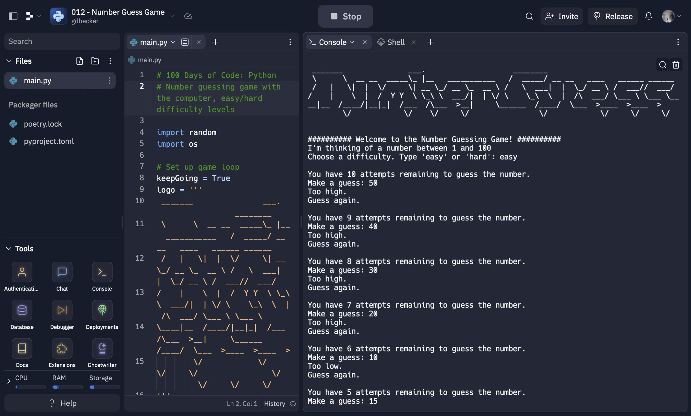

# 012 - Number Guess Game

Number guessing game with the computer with easy/hard difficulty levels

### Project Type

Scripting

### Demo View

### Links

- [Live Demo](https://replit.com/@gdbecker/012-Number-Guess-Game)

### Tools & Packages

- [Python](https://www.python.org)
- random
- os
- [VS Code](https://code.visualstudio.com)

### Skills Used

- Print statements
- User input
- While loops
- If statements
- f strings

## Author

- Website - [Garrett Becker]()
- Replit - [@gdbecker](https://replit.com/@gdbecker)
- LinkedIn - [Garrett Becker](https://www.linkedin.com/in/garrett-becker-923b4a106/)