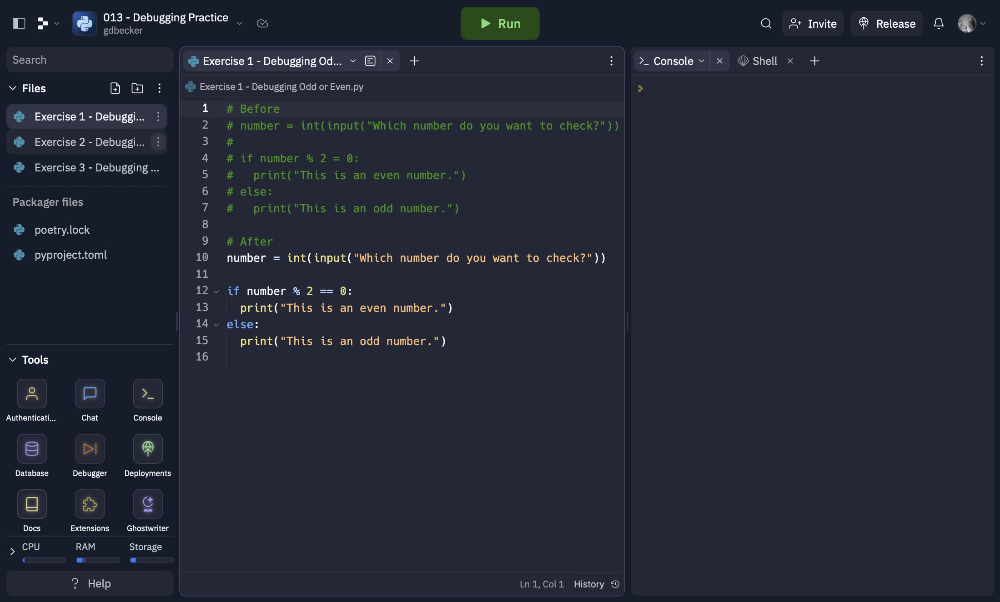

# 013 - Debugging Practice

Three practice problems for debugging Python code. Features the broken code before and then my solutions after.

### Project Type

Debugging

### Demo View

### Links

- [Live Demo](https://replit.com/@gdbecker/013-Debugging-Practice)

### Tools & Packages

- [Python](https://www.python.org)
- [VS Code](https://code.visualstudio.com)

### Skills Used

- Debugging code

## Author

- Website - [Garrett Becker]()
- Replit - [@gdbecker](https://replit.com/@gdbecker)
- LinkedIn - [Garrett Becker](https://www.linkedin.com/in/garrett-becker-923b4a106/)