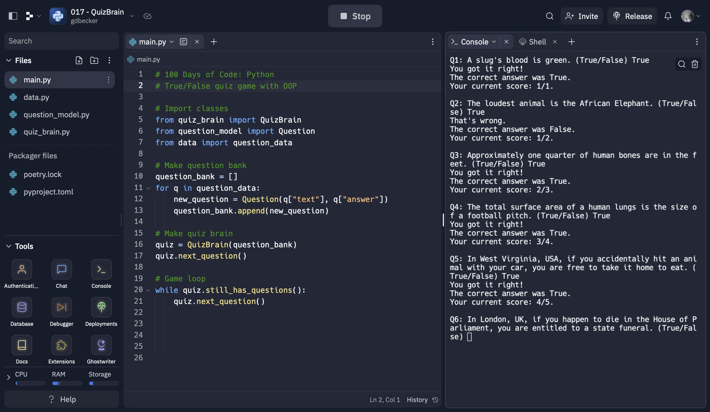

# 017 - QuizBrain

True/False quiz game with OOP

### Project Type

Scripting

### Demo View

### Links

- [Live Demo](https://replit.com/@gdbecker/017-QuizBrain)

### Tools & Packages

- [Python](https://www.python.org)
- [VS Code](https://code.visualstudio.com)

### Skills Used

- OOP
- Print statements
- User input
- While loops
- If statements
- f strings
- Methods
- Lists
- Dictionaries

## Author

- Website - [Garrett Becker]()
- Replit - [@gdbecker](https://replit.com/@gdbecker)
- LinkedIn - [Garrett Becker](https://www.linkedin.com/in/garrett-becker-923b4a106/)