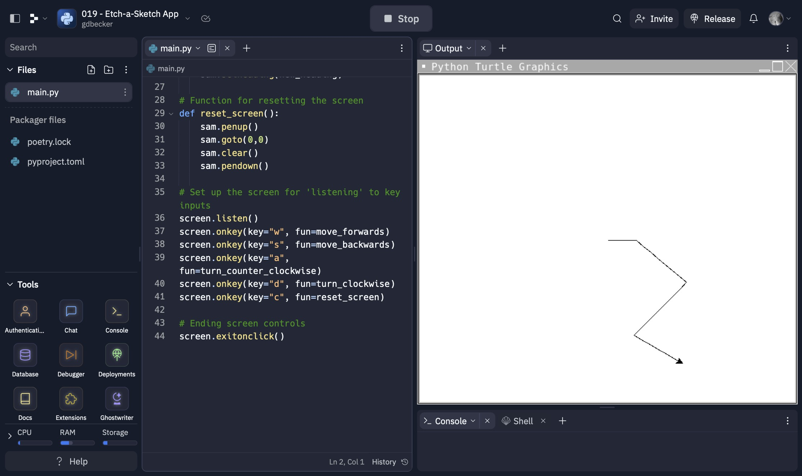

# 019 - Etch-a-Sketch App

Etch-A-Sketch app with Turtle class

### Project Type

GUI

### Demo View

### Links

- [Live Demo](https://replit.com/@gdbecker/019-Etch-a-Sketch-App)

### Tools & Packages

- [Python](https://www.python.org)
- turtle
- [VS Code](https://code.visualstudio.com)

### Skills Used

- Turtle class UI
- Methods

## Author

- Website - [Garrett Becker]()
- Replit - [@gdbecker](https://replit.com/@gdbecker)
- LinkedIn - [Garrett Becker](https://www.linkedin.com/in/garrett-becker-923b4a106/)