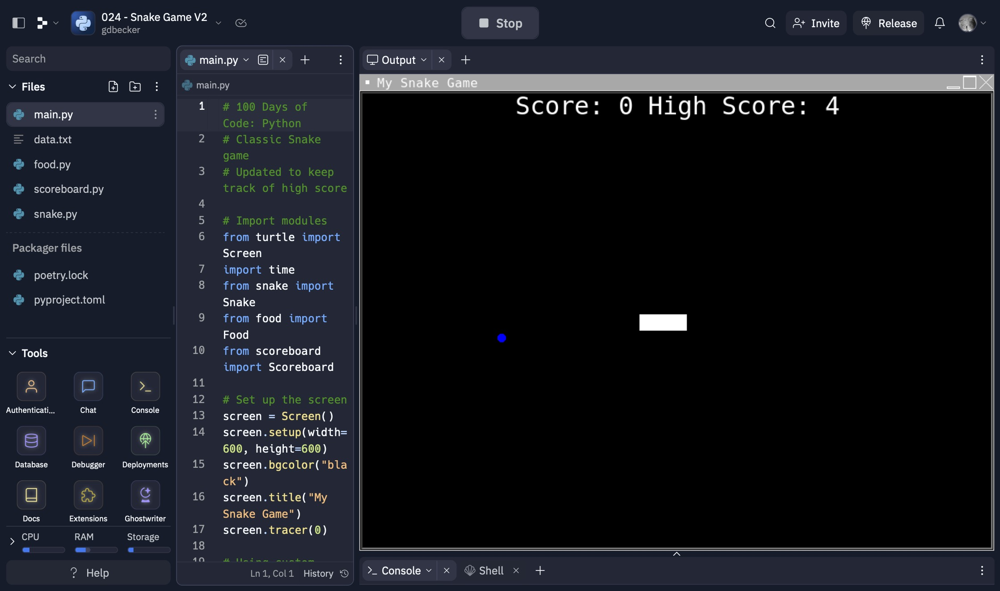

# 024 - Snake Game V2

Classic Snake game with OOP. Updated from V1 to keep track of the high score.

### Project Type

Game

### Demo View

### Links

- [Live Demo](https://replit.com/@gdbecker/024-Snake-Game-V2)

### Tools & Packages

- [Python](https://www.python.org)
- turtle
- random
- time
- [VS Code](https://code.visualstudio.com)

### Skills Used

- Turtle class UI
- Methods
- For loops
- While loops
- If statements
- Tuples

## Author

- Website - [Garrett Becker]()
- Replit - [@gdbecker](https://replit.com/@gdbecker)
- LinkedIn - [Garrett Becker](https://www.linkedin.com/in/garrett-becker-923b4a106/)