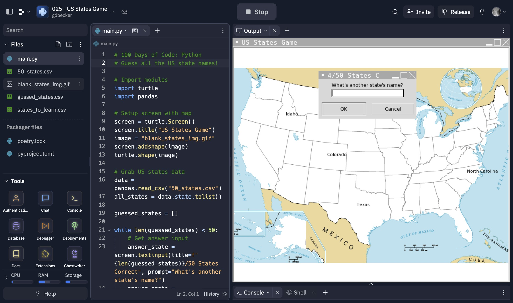

# 025 - US States Game

Guess all the US state names!

### Project Type

Game

### Demo View

### Links

- [Live Demo](https://replit.com/@gdbecker/025-US-States-Game)

### Tools & Packages

- [Python](https://www.python.org)
- turtle
- pandas
- [VS Code](https://code.visualstudio.com)

### Skills Used

- Turtle class UI
- Pandas dataframes
- File handling
- For loops
- While loops
- If statements
- Lists

### Other files in this folder

Practicing using Pandas with squirrels and weather data.

## Author

- Website - [Garrett Becker]()
- Replit - [@gdbecker](https://replit.com/@gdbecker)
- LinkedIn - [Garrett Becker](https://www.linkedin.com/in/garrett-becker-923b4a106/)