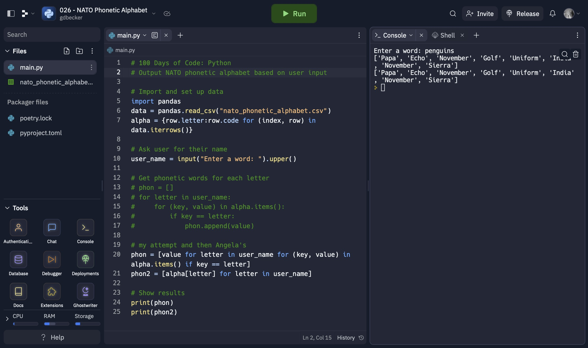

# 026 - NATO Phonetic Alphabet

Output NATO phonetic alphabet based on user input

### Project Type

Scripting

### Demo View

### Links

- [Live Demo](https://replit.com/@gdbecker/026-NATO-Phonetic-Alphabet)

### Tools & Packages

- [Python](https://www.python.org)
- pandas
- [VS Code](https://code.visualstudio.com)

### Skills Used

- Pandas dataframes
- File handling
- List comprehension
- Lists
- Dictionary comprehension
- Dictionaries

### Other files in this folder

Exercises to practice list and dictionary comprehension.

## Author

- Website - [Garrett Becker]()
- Replit - [@gdbecker](https://replit.com/@gdbecker)
- LinkedIn - [Garrett Becker](https://www.linkedin.com/in/garrett-becker-923b4a106/)