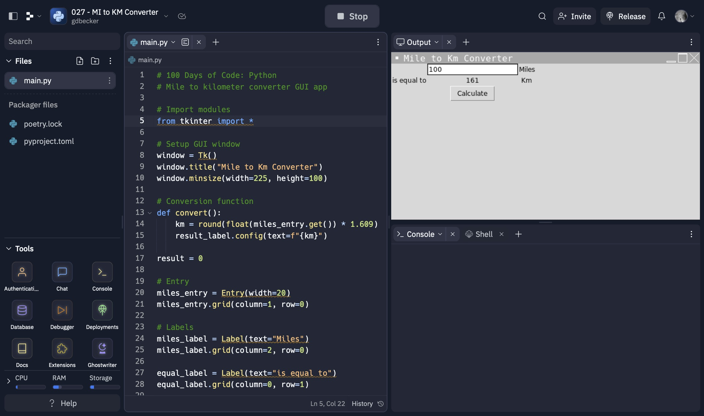

# 027 - MI to KM Converter

Mile to kilometer converter GUI app

### Project Type

GUI

### Demo View

### Links

- [Live Demo](https://replit.com/@gdbecker/027-MI-to-KM-Converter)

### Tools & Packages

- [Python](https://www.python.org)
- tkinter
- [VS Code](https://code.visualstudio.com)

### Skills Used

- tkinter class UI
- Methods
- Float casting

### Other files in this folder

Practicing using tkinter.

## Author

- Website - [Garrett Becker]()
- Replit - [@gdbecker](https://replit.com/@gdbecker)
- LinkedIn - [Garrett Becker](https://www.linkedin.com/in/garrett-becker-923b4a106/)