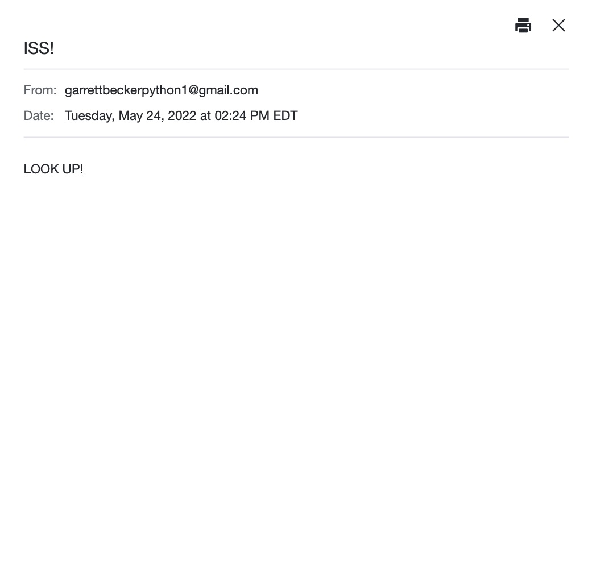

# 033 - ISS Email Notifications

Get an email notification if the ISS is above you

### Project Type

API, Automation

### Demo View

### Links

- [Live Demo](https://replit.com/@gdbecker/033-ISS-Email-Notifications)

### Tools & Packages

- [Python](https://www.python.org)
- smtplib
- os
- requests
- datetime
- [VS Code](https://code.visualstudio.com)

### Skills Used

- API connectivity
- If statements
- For loops
- Lists
- Print statements
- f strings
- smtp email auth

## Author

- Website - [Garrett Becker]()
- Replit - [@gdbecker](https://replit.com/@gdbecker)
- LinkedIn - [Garrett Becker](https://www.linkedin.com/in/garrett-becker-923b4a106/)