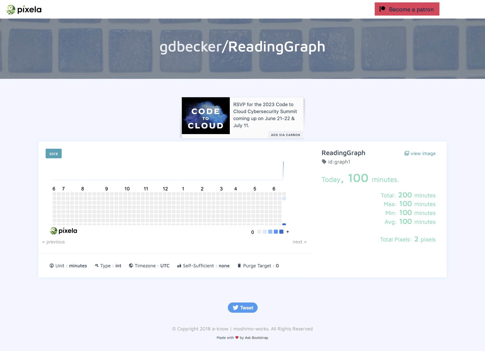

# 037 - Habit Tracker

Keep track of habits with Pixela

### Project Type

API, Automation

### Demo View

### Links

- [Live Demo](https://replit.com/@gdbecker/037-Habit-Tracker)

### Tools & Packages

- [Python](https://www.python.org)
- requests
- os
- datetime
- [VS Code](https://code.visualstudio.com)

### Skills Used

- API connectivity
- Dictionaries
- Environment variables

## Author

- Website - [Garrett Becker]()
- Replit - [@gdbecker](https://replit.com/@gdbecker)
- LinkedIn - [Garrett Becker](https://www.linkedin.com/in/garrett-becker-923b4a106/)