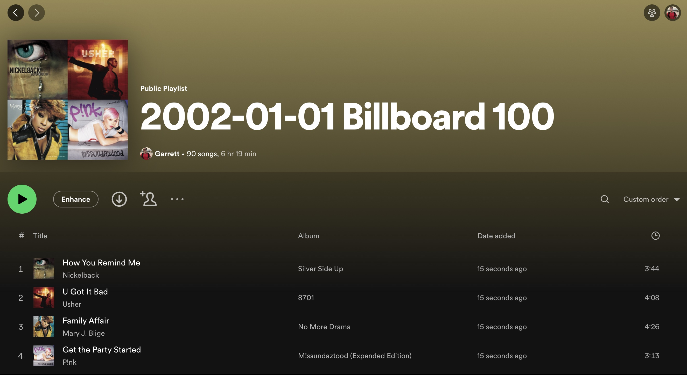

# 046 - Spotify Playlist Automation

Make Spotify playlist for top Billboard 100 songs of a given year

### Project Type

API, Automation, Web Scraping

### Demo View

### Links

- [Live Demo]()

### Tools & Packages

- [Python](https://www.python.org)
- requests
- bs4
- spotipy
- decouple
- [VS Code](https://code.visualstudio.com)

### Skills Used

- API connectivity
- Spotify & Python connection
- User input
- Dictionaries
- Print statements
- For loops
- Environment variables
- try/except

## Author

- Website - [Garrett Becker]()
- Replit - [@gdbecker](https://replit.com/@gdbecker)
- LinkedIn - [Garrett Becker](https://www.linkedin.com/in/garrett-becker-923b4a106/)