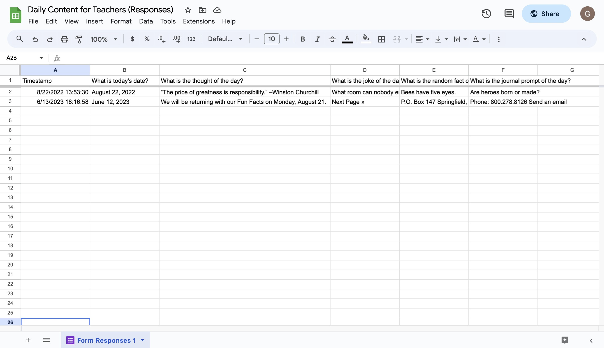

# 049 - Great Teacher

Collect daily thoughts, jokes, random facts and journal prompts for teachers using Selenium webdriver, BeautifulSoup, Google Forms

### Project Type

Automation, Web Scraping

### Demo View

### Links

- [Live Demo](https://replit.com/@gdbecker/049-Great-Teacher)

### Tools & Packages

- [Python](https://www.python.org)
- selenium
- time
- bs4
- requests
- random
- [VS Code](https://code.visualstudio.com)

### Skills Used

- Selenium web driver
- Lists
- Print statements

## Author

- Website - [Garrett Becker]()
- Replit - [@gdbecker](https://replit.com/@gdbecker)
- LinkedIn - [Garrett Becker](https://www.linkedin.com/in/garrett-becker-923b4a106/)