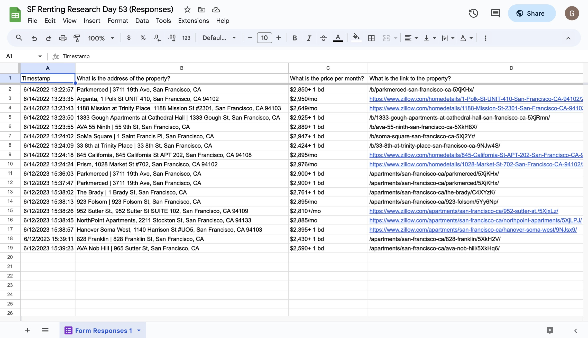

# 053 - Zillow Research

Research apartments for rent in SF and record what you find using Selenium webdriver, BeautifulSoup, Google Forms

### Project Type

API, Automation, Web Scraping

### Demo View

### Links

- [Live Demo](https://replit.com/@gdbecker/053-Zillow-Research)

### Tools & Packages

- [Python](https://www.python.org)
- requests
- bs4
- random
- selenium
- time
- [VS Code](https://code.visualstudio.com)

### Skills Used

- Selenium web driver
- API connectivity
- If statements
- For loops
- Lists
- Dictionaries

## Author

- Website - [Garrett Becker]()
- Replit - [@gdbecker](https://replit.com/@gdbecker)
- LinkedIn - [Garrett Becker](https://www.linkedin.com/in/garrett-becker-923b4a106/)