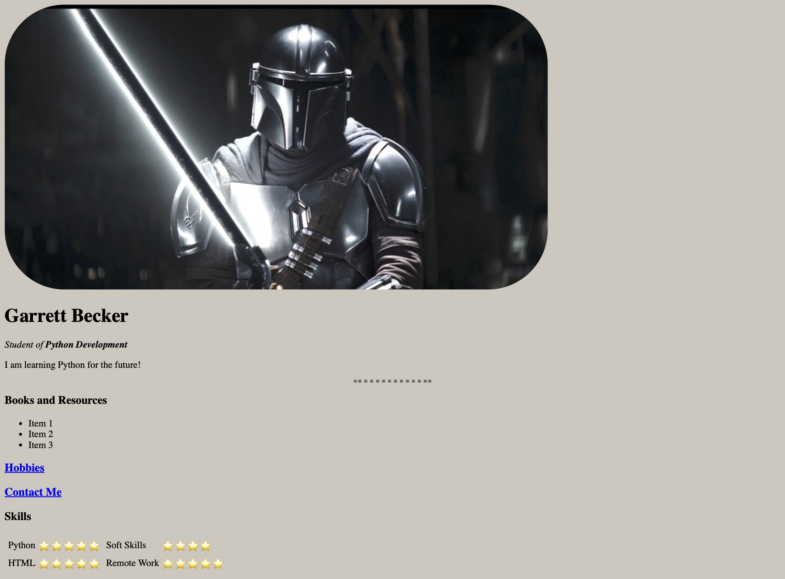

# 041-044 - Personal Site

These days covered a couple of different versions for a personal website - one with a more rudimentary design (labled with HTML) and another with additional stylistic choices (labeled with CSS). Both covered basics of front-end web design to use for future projects.

### Project Type

Web Development

### Demo View - HTML Version

### Demo View - CSS Version

### Links

- [Live Demo - HTML Version](https://041-044-personal-site-html-gdbecker.replit.app/)
- [Live Demo - CSS Version](https://041-044-personal-site-css-gdbecker.replit.app/)

### Tools & Packages

- HTML
- CSS
- [VS Code](https://code.visualstudio.com)

### Skills Used

- Front-end web design

## Author

- Website - [Garrett Becker]()
- Replit - [@gdbecker](https://replit.com/@gdbecker)
- LinkedIn - [Garrett Becker](https://www.linkedin.com/in/garrett-becker-923b4a106/)
