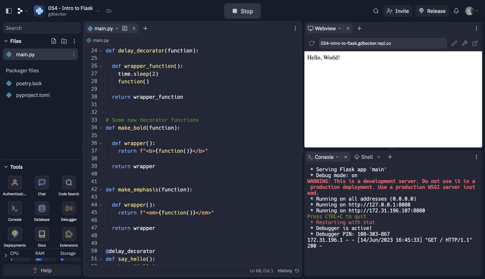

# 054 - Intro to Flask

Learning to build web apps with Flask framework

### Project Type

Web Development

### Demo View

### Links

- [Live Demo](https://replit.com/@gdbecker/054-Intro-to-Flask)

### Tools & Packages

- [Python](https://www.python.org)
- Flask
- time
- [VS Code](https://code.visualstudio.com)

### Skills Used

- Flask web development framework
- Methods
- Decorators

## Author

- Website - [Garrett Becker]()
- Replit - [@gdbecker](https://replit.com/@gdbecker)
- LinkedIn - [Garrett Becker](https://www.linkedin.com/in/garrett-becker-923b4a106/)