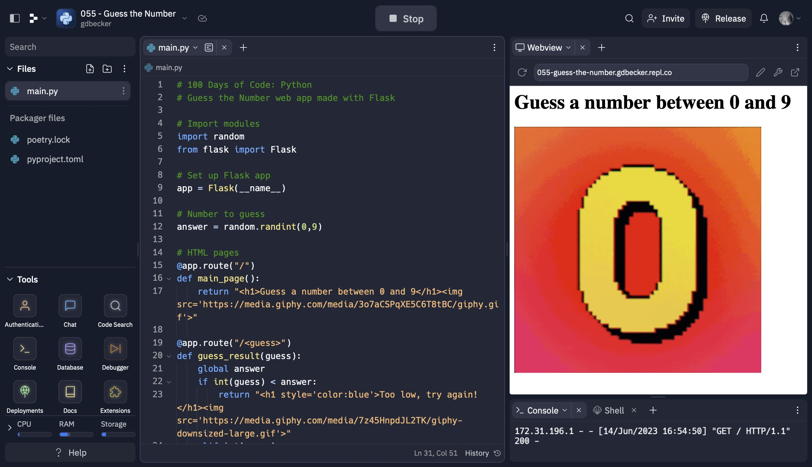

# 055 - Guess the Number

Guess the Number web app made with Flask

### Project Type

Web Development

### Demo View

### Links

- [Live Demo](https://replit.com/@gdbecker/055-Guess-the-Number)

### Tools & Packages

- [Python](https://www.python.org)
- Flask
- random
- [VS Code](https://code.visualstudio.com)

### Skills Used

- Flask web development framework
- Methods
- Decorators
- If statements

## Author

- Website - [Garrett Becker]()
- Replit - [@gdbecker](https://replit.com/@gdbecker)
- LinkedIn - [Garrett Becker](https://www.linkedin.com/in/garrett-becker-923b4a106/)