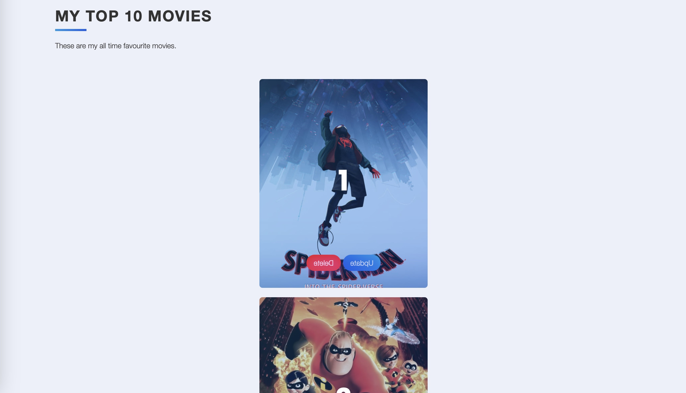

# 064 - Top 10 Movies Web App

Practicing Flask: top 10 movies web app via API data source

### Project Type

API, Web Development

### Demo View

### Links

- [Live Demo](https://replit.com/@gdbecker/064-Top-10-Movies-Web-App)

### Tools & Packages

- [Python](https://www.python.org)
- Flask
- flask-wtf
- wtforms
- flask-sqlalchemy
- sqlite3
- Bootstrap
- os
- HTML
- CSS
- [VS Code](https://code.visualstudio.com)

### Skills Used

- Flask web development framework
- Bootstrap framework
- Methods
- Decorators
- If statements
- For loops
- Dictionaries
- Databases
- Front-end web design
- Environment variables

## Author

- Website - [Garrett Becker]()
- Replit - [@gdbecker](https://replit.com/@gdbecker)
- LinkedIn - [Garrett Becker](https://www.linkedin.com/in/garrett-becker-923b4a106/)