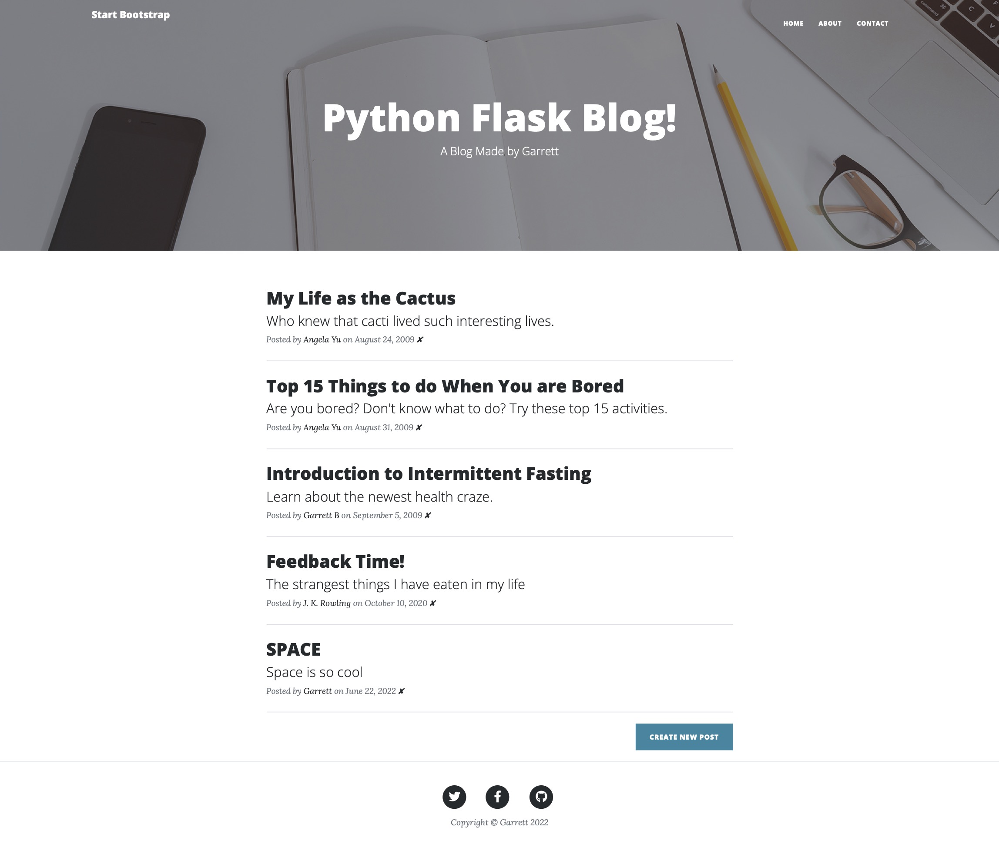

# 067 - Blog Web App V3

Blog site project made with Flask. Updated from Day 059-060 V2 with additional REST functions like creating, editing, and deleting new blog posts.

### Project Type

Web Development

### Demo View

### Links

- [Live Demo](https://replit.com/@gdbecker/067-Blog-Web-App-V3)

### Tools & Packages

- [Python](https://www.python.org)
- Flask
- requests
- datetime
- smtplib
- Bootstrap
- flask-sqlalchemy
- flask-wtf
- wtforms
- flask-ckeditor
- HTML
- CSS
- [VS Code](https://code.visualstudio.com)

### Skills Used

- Flask web development framework
- Methods
- Decorators
- For loops
- If statements
- Dictionaries
- smtp email auth
- Front-end web design
- REST architecture

## Author

- Website - [Garrett Becker]()
- Replit - [@gdbecker](https://replit.com/@gdbecker)
- LinkedIn - [Garrett Becker](https://www.linkedin.com/in/garrett-becker-923b4a106/)