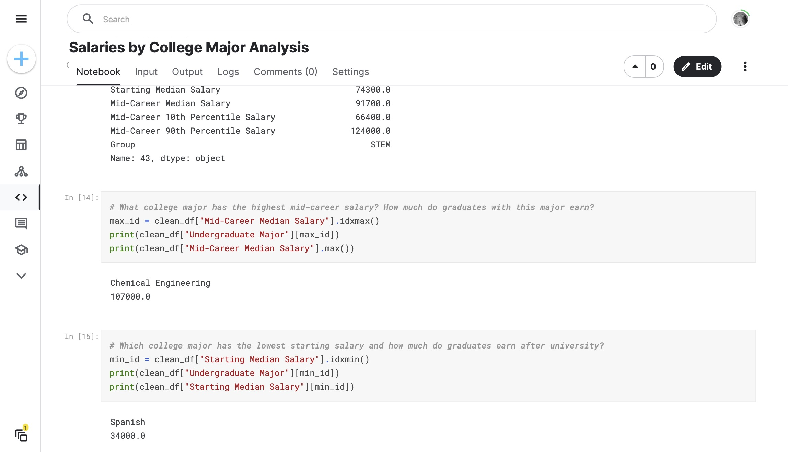

# 071 - Salaries by College Major Analysis

Analyzing salries by college major from [this Kaggle dataset](https://www.kaggle.com/datasets/darodysylvainobei/payscale-inc-data-on-college-majors).

### Project Type

Data Science

### Demo View

### Links

- [Live Demo](https://www.kaggle.com/code/garrettbecker/salaries-by-college-major-analysis)

### Tools & Packages

- [Python](https://www.python.org)
- pandas
- [Jupyter Notebooks]()

### Learning Points

- Use .head(), .tail(), .shape and .columns to explore your DataFrame and find out the number of rows and columns as well as the column names.
- Look for NaN (not a number) values with .findna() and consider using .dropna() to clean up your DataFrame.
- You can access entire columns of a DataFrame using the square bracket notation: df['column name'] or df[['column name 1', 'column name 2', 'column name 3']]
- You can access individual cells in a DataFrame by chaining square brackets df['column name'][index] or using df['column name'].loc[index]
- The largest and smallest values, as well as their positions, can be found with methods like .max(), .min(), .idxmax() and .idxmin()
- You can sort the DataFrame with .sort_values() and add new columns with .insert()
- To create an Excel Style Pivot Table by grouping entries that belong to a particular category use the .groupby() method

## Author

- Website - [Garrett Becker]()
- Replit - [@gdbecker](https://replit.com/@gdbecker)
- LinkedIn - [Garrett Becker](https://www.linkedin.com/in/garrett-becker-923b4a106/)