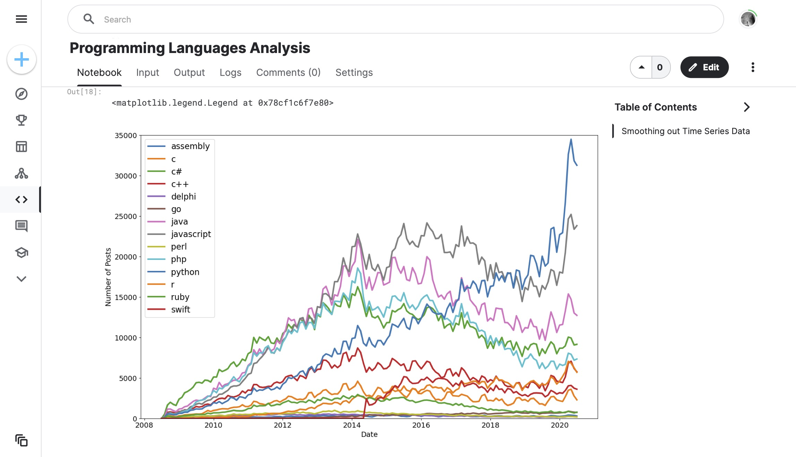

# 072 - Programming Languages Analysis

Analyzing programming languages from [this Kaggle dataset](https://www.kaggle.com/datasets/rohitthakur/programming-language-popularity).

### Project Type

Data Science

### Demo View

### Links

- [Live Demo](https://www.kaggle.com/code/garrettbecker/programming-languages-analysis/notebook)

### Tools & Packages

- [Python](https://www.python.org)
- pandas
- datetime
- matplotlib
- [Jupyter Notebooks](https://jupyter.org)

### Learning Points

- used .groupby() to explore the number of posts and entries per programming language
- converted strings to Datetime objects with to_datetime() for easier plotting
- reshaped our DataFrame by converting categories to columns using .pivot()
- used .count() and isna().values.any() to look for NaN values in our DataFrame, which we then replaced using .fillna()
- created (multiple) line charts using .plot() with a for-loop
- styled our charts by changing the size, the labels, and the upper and lower bounds of our axis.
- added a legend to tell apart which line is which by colour
- smoothed out our time-series observations with .rolling().mean() and plotted them to better identify trends over time.

## Author

- Website - [Garrett Becker]()
- Replit - [@gdbecker](https://replit.com/@gdbecker)
- LinkedIn - [Garrett Becker](https://www.linkedin.com/in/garrett-becker-923b4a106/)