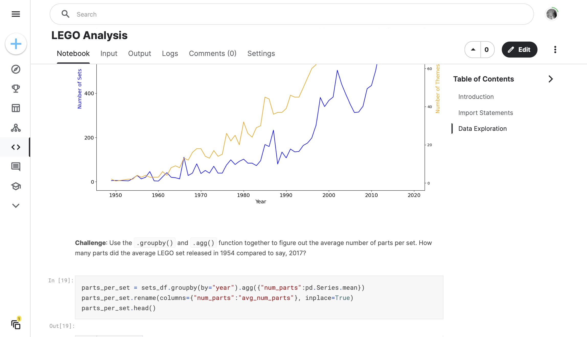

# 073 - LEGO Analysis

Analyzing LEGO colors and themes from these Kaggle datasets:
- [LEGO Data](https://www.kaggle.com/datasets/salmane/lego-data)
- [LEGO Database](https://www.kaggle.com/datasets/rtatman/lego-database)

### Project Type

Data Science

### Demo View

### Links

- [Live Demo](https://www.kaggle.com/code/garrettbecker/lego-analysis/notebook)

### Tools & Packages

- [Python](https://www.python.org)
- pandas
- matplotlib
- [Jupyter Notebooks](https://jupyter.org)

### Learning Points

- use HTML Markdown in Notebooks, such as section headings # and how to embed img with the  tag.
- combine the groupby() and count() functions to aggregate data
- use the .value_counts() function
- slice DataFrames using the square bracket notation e.g., df[:-2] or df[:10]
- use the .agg() function to run an operation on a particular column
- rename() columns of DataFrames
- create a line chart with two separate axes to visualise data that have different scales.
- create a scatter plot in Matplotlib
- work with tables in a relational database by using primary and foreign keys
- .merge() DataFrames along a particular column
- create a bar chart with Matplotlib

## Author

- Website - [Garrett Becker]()
- Replit - [@gdbecker](https://replit.com/@gdbecker)
- LinkedIn - [Garrett Becker](https://www.linkedin.com/in/garrett-becker-923b4a106/)