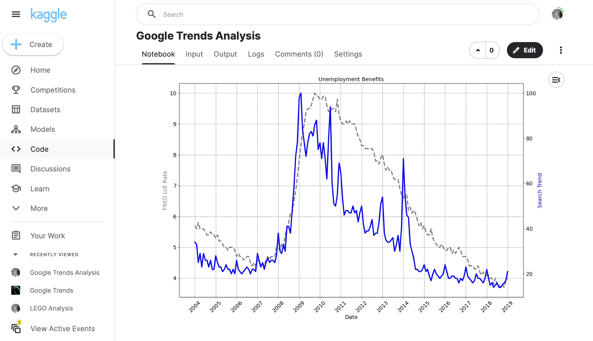

# 074 - Google Trends Analysis

Analyzing Google search trends from [this Kaggle dataset](https://www.kaggle.com/datasets/salmane/google-trends).

### Project Type

Data Science

### Demo View

### Links

- [Live Demo](https://www.kaggle.com/code/garrettbecker/google-trends-analysis/notebook)

### Tools & Packages

- [Python](https://www.python.org)
- pandas
- matplotlib
- [Jupyter Notebooks](https://jupyter.org)

### Learning Points

- How to use .describe() to quickly see some descriptive statistics at a glance.
- How to use .resample() to make a time-series data comparable to another by changing the periodicity.
- How to work with matplotlib.dates Locators to better style a timeline (e.g., an axis on a chart).
- How to find the number of NaN values with .isna().values.sum()
- How to change the resolution of a chart using the figure's dpi
- How to create dashed '--' and dotted '-.' lines using linestyles
- How to use different kinds of markers (e.g., 'o' or '^') on charts.
- Fine-tuning the styling of Matplotlib charts by using limits, labels, linewidth and colours (both in the form of named colours and HEX codes).
- Using .grid() to help visually identify seasonality in a time series.

## Author

- Website - [Garrett Becker]()
- Replit - [@gdbecker](https://replit.com/@gdbecker)
- LinkedIn - [Garrett Becker](https://www.linkedin.com/in/garrett-becker-923b4a106/)