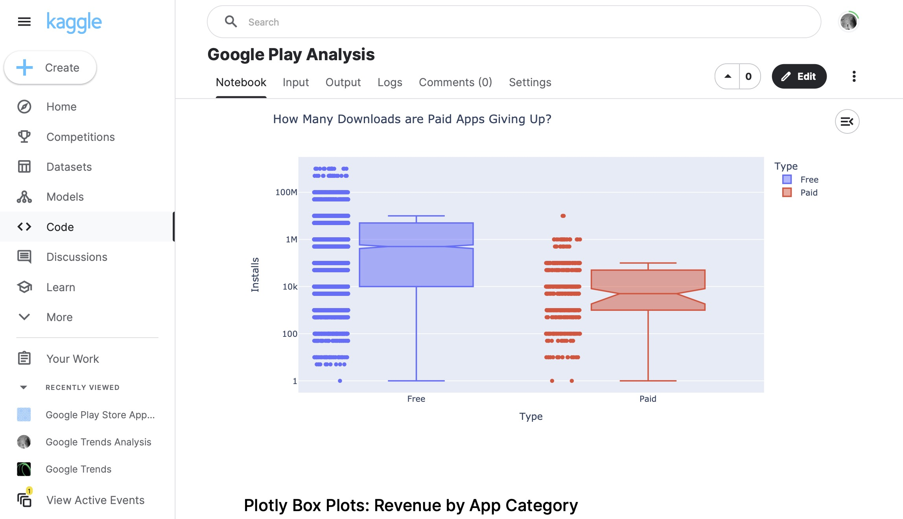

# 075 - Google Play Analysis

Analyzing Google Play apps from [this Kaggle dataset](https://www.kaggle.com/datasets/zgrbalbay/google-play-store-apps-reviews).

### Project Type

Data Science

### Demo View

### Links

- [Live Demo](https://www.kaggle.com/code/garrettbecker/google-play-analysis/notebook)

### Tools & Packages

- [Python](https://www.python.org)
- pandas
- matplotlib
- plotly
- [Jupyter Notebooks](https://jupyter.org)

### Learning Points

- Pull a random sample from a DataFrame using .sample()
- How to find duplicate entries with .duplicated() and .drop_duplicates()
- How to convert string and object data types into numbers with .to_numeric()
- How to use plotly to generate beautiful pie, donut, and bar charts as well as box and scatter plots

## Author

- Website - [Garrett Becker]()
- Replit - [@gdbecker](https://replit.com/@gdbecker)
- LinkedIn - [Garrett Becker](https://www.linkedin.com/in/garrett-becker-923b4a106/)