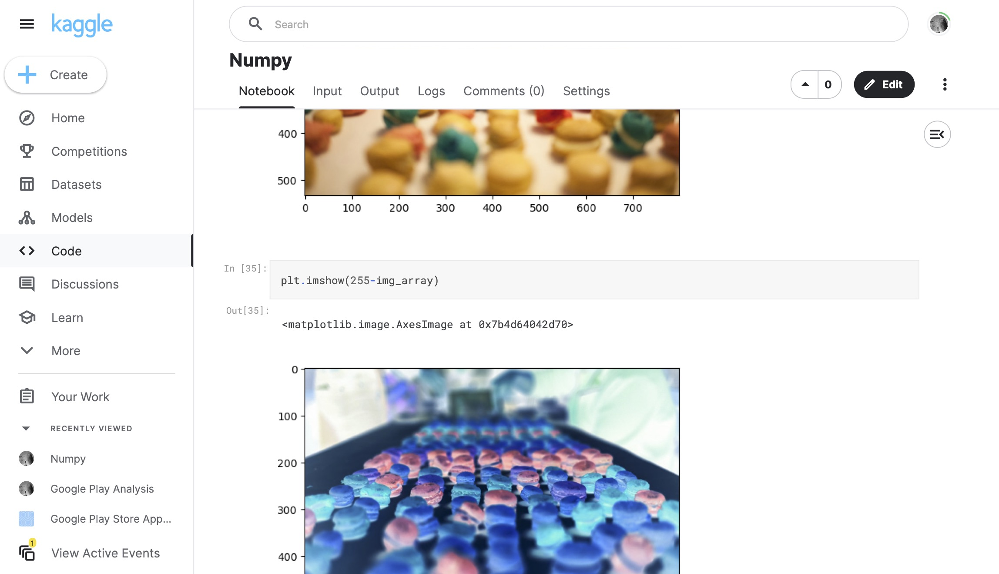

# 076 - Numpy Practice

Learning to use the Numpy package through a variety of exercises.

### Project Type

Data Science

### Demo View

### Links

- [Live Demo](https://www.kaggle.com/code/garrettbecker/numpy/notebook)

### Tools & Packages

- [Python](https://www.python.org)
- numpy
- matplotlib
- scipy
- PIL
- [Jupyter Notebooks](https://jupyter.org)

### Learning Points

- Create arrays manually with np.array()
- Generate arrays using  .arange(), .random(), and .linspace()
- Analyse the shape and dimensions of a ndarray
- Slice and subset a ndarray based on its indices
- Do linear algebra like operations with scalars and matrix multiplication
- Use NumPys broadcasting to make ndarray shapes compatible
- Manipulate img in the form of ndarrays

## Author

- Website - [Garrett Becker]()
- Replit - [@gdbecker](https://replit.com/@gdbecker)
- LinkedIn - [Garrett Becker](https://www.linkedin.com/in/garrett-becker-923b4a106/)
