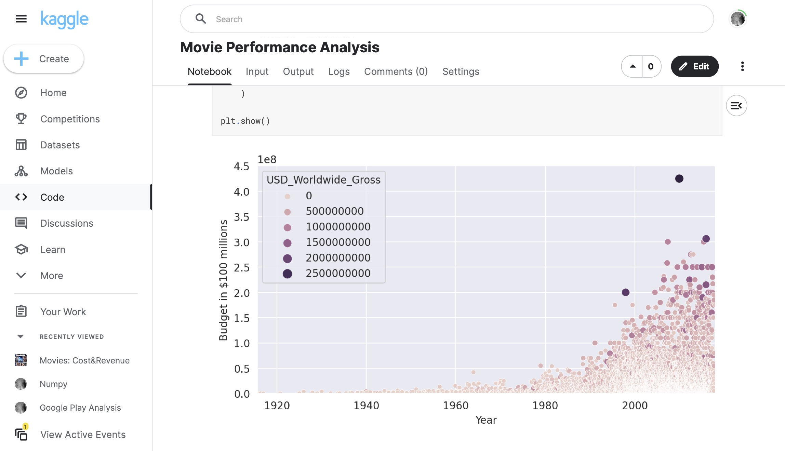

# 077 - Movie Performance Analysis

Analyzing movies' box office performances from [this Kaggle dataset](https://www.kaggle.com/datasets/salmane/movies-costrevenue).

### Project Type

Data Science

### Demo View

### Links

- [Live Demo](https://www.kaggle.com/code/garrettbecker/movie-performance-analysis/notebook)

### Tools & Packages

- [Python](https://www.python.org)
- pandas
- matplotlib
- seaborn
- sklearn
- [Jupyter Notebooks](https://jupyter.org)

### Learning Points

- Use nested loops to remove unwanted characters from multiple columns
- Filter Pandas DataFrames based on multiple conditions using both .loc[] and .query()
- Create bubble charts using the Seaborn Library
- Style Seaborn charts using the pre-built styles and by modifying Matplotlib parameters
- Use floor division (i.e., integer division) to convert years to decades
- Use Seaborn to superimpose a linear regressions over our data
- Make a judgement if our regression is good or bad based on how well the model fits our data and the r-squared metric
- Run regressions with scikit-learn and calculate the coefficients.

## Author

- Website - [Garrett Becker]()
- Replit - [@gdbecker](https://replit.com/@gdbecker)
- LinkedIn - [Garrett Becker](https://www.linkedin.com/in/garrett-becker-923b4a106/)