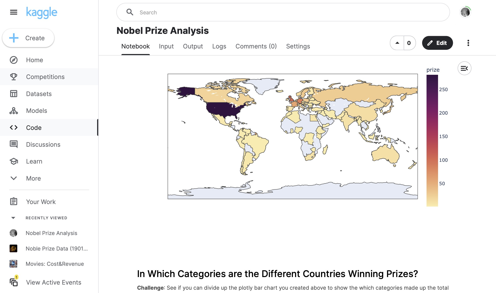

# 078 - Nobel Prize Analysis

Analyzing Nobel Peace Prizes from [this Kaggle dataset](https://www.kaggle.com/datasets/salmane/noble-prize-data-1901-1920).

### Project Type

Data Science

### Demo View

### Links

- [Live Demo](https://www.kaggle.com/code/garrettbecker/nobel-prize-analysis)

### Tools & Packages

- [Python](https://www.python.org)
- pandas
- numpy
- plotly
- matplotlib
- seaborn
- fractions
- [Jupyter Notebooks](https://jupyter.org)

### Learning Points

- How to uncover and investigate NaN values.
- How to convert objects and string data types to numbers.
- Creating donut and bar charts with plotly.
- Create a rolling average to smooth out time-series data and show a trend.
- How to use .value_counts(), .groupby(), .merge(), .sort_values() and .agg().
- Create a Choropleth to display data on a map.
- Create bar charts showing different segments of the data with plotly.
- Create Sunburst charts with plotly.
- Use Seaborn's .lmplot() and show best-fit lines across multiple categories using the row, hue, and lowess parameters.
- Understand how a different picture emerges when looking at the same data in different ways (e.g., box plots vs a time series analysis).
- See the distribution of our data and visualise descriptive statistics with the help of a histogram in Seaborn.

## Author

- Website - [Garrett Becker]()
- Replit - [@gdbecker](https://replit.com/@gdbecker)
- LinkedIn - [Garrett Becker](https://www.linkedin.com/in/garrett-becker-923b4a106/)