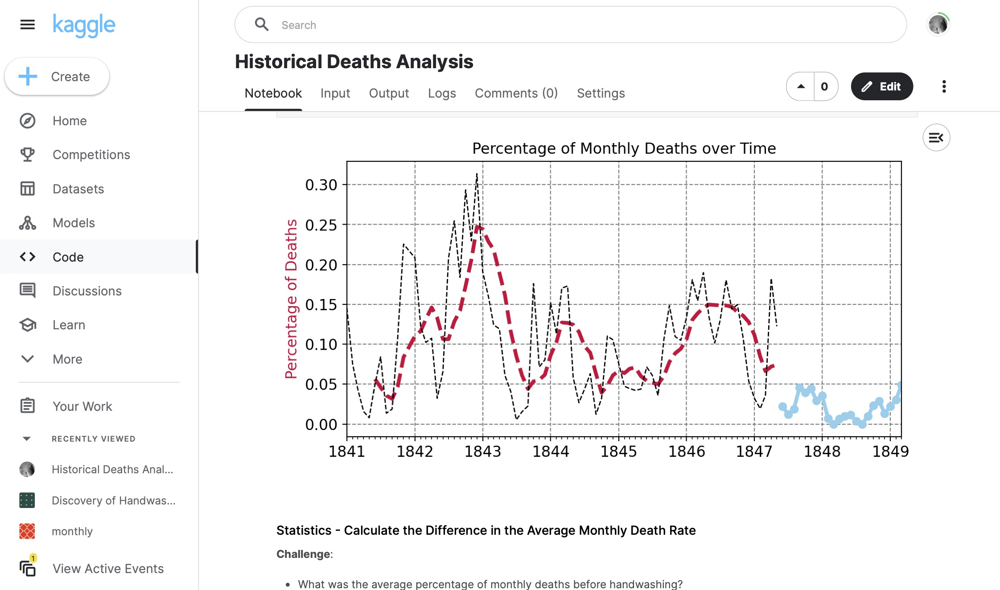

# 079 - Historical Deaths Analysis

Analyzing deaths at the Vienna General Hospital between 1841-1849 from these Kaggle datasets:
- [Monthly](https://www.kaggle.com/datasets/jainmegha835/monthly)
- [Annual](https://www.kaggle.com/datasets/chidsanuchaipun/handwashing-data)

### Project Type

Data Science

### Demo View

### Links

- [Live Demo](https://www.kaggle.com/code/garrettbecker/historical-deaths-analysis/notebook)

### Tools & Packages

- [Python](https://www.python.org)
- pandas
- numpy
- plotly
- matplotlib
- seaborn
- scipy
- [Jupyter Notebooks](https://jupyter.org)

### Learning Points

- How to use histograms to visualise distributions
- How to superimpose histograms on top of each other even when the data series have different lengths
- How to use a to smooth out kinks in a histogram and visualise a distribution with a Kernel Density Estimate (KDE)
- How to improve a KDE by specifying boundaries on the estimates
- How to use scipy and test for statistical significance by looking at p-values.
- How to highlight different parts of a time series chart in Matplotib.
- How to add and configure a Legend in Matplotlib.
- Use NumPy's .where() function to process elements depending on a condition.

## Author

- Website - [Garrett Becker]()
- Replit - [@gdbecker](https://replit.com/@gdbecker)
- LinkedIn - [Garrett Becker](https://www.linkedin.com/in/garrett-becker-923b4a106/)