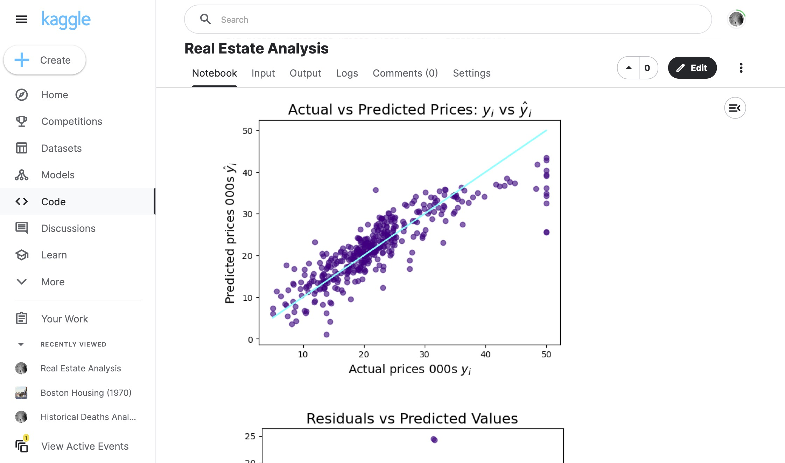

# 080 - Real Estate Analysis

Analyzing the Boston housing market in 1970 from [this Kaggle dataset](https://www.kaggle.com/datasets/salmane/boston).

### Project Type

Data Science

### Demo View

### Links

- [Live Demo](https://www.kaggle.com/code/garrettbecker/real-estate-analysis/notebook)

### Tools & Packages

- [Python](https://www.python.org)
- pandas
- numpy
- plotly
- matplotlib
- seaborn
- sklearn
- [Jupyter Notebooks](https://jupyter.org)

### Learning Points

- How to quickly spot relationships in a dataset using Seaborn's .pairplot().
- How to split the data into a training and testing dataset to better evaluate a model's performance.
- How to run a multivariable regression.
- How to evaluate that regression-based on the sign of its coefficients.
- How to analyse and look for patterns in a model's residuals.
- How to improve a regression model using (a log) data transformation.
- How to specify your own values for various features and use your model to make a prediction.

## Author

- Website - [Garrett Becker]()
- Replit - [@gdbecker](https://replit.com/@gdbecker)
- LinkedIn - [Garrett Becker](https://www.linkedin.com/in/garrett-becker-923b4a106/)