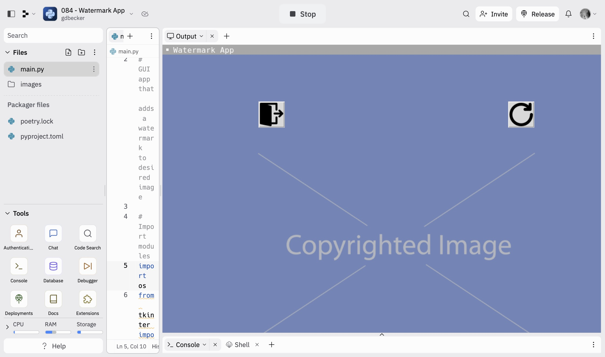

# 084 - Watermark App

GUI app to add a watermark on a selected image

### Project Type

GUI

### Demo View

### Links

- [Live Demo](https://replit.com/@gdbecker/084-Watermark-App)

### Tools & Packages

- [Python](https://www.python.org)
- tkinter
- os
- PIL
- [VS Code](https://code.visualstudio.com)

### Skills Used

- tkinter class UI
- Methods
- If statements
- Dictionaries

## Author

- Website - [Garrett Becker]()
- Replit - [@gdbecker](https://replit.com/@gdbecker)
- LinkedIn - [Garrett Becker](https://www.linkedin.com/in/garrett-becker-923b4a106/)