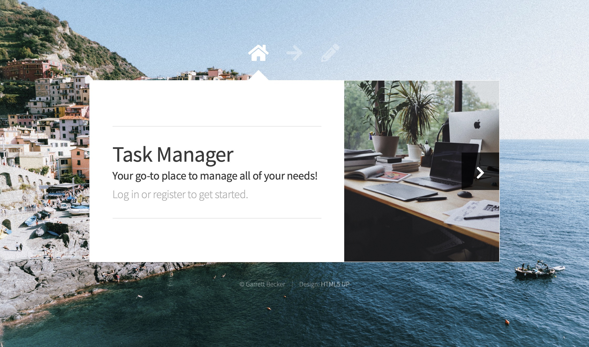

# 088 - TaskManager Web App - Flask

Log into your account and manage your to-do list with this handy web app! Same app as day 082's project except built with Flask as the back-end framework.

### Project Type

Web Development

### Demo View

### Links

- [Live Demo](https://replit.com/@gdbecker/088-Task-Manager-Web-App-Flask)

### Tools & Packages

- [Python](https://www.python.org)
- Flask
- flask-wtf
- wtforms
- flask-sqlalchemy
- Bootstrap
- csv
- HTML
- CSS
- [VS Code](https://code.visualstudio.com)

### Skills Used

- Flask web development framework
- Bootstrap framework
- Methods
- Decorators
- If statements
- Dictionaries
- File handling
- Front-end web design
- REST architecture
- Databases
- Authentication

## Author

- Website - [Garrett Becker]()
- Replit - [@gdbecker](https://replit.com/@gdbecker)
- LinkedIn - [Garrett Becker](https://www.linkedin.com/in/garrett-becker-923b4a106/)