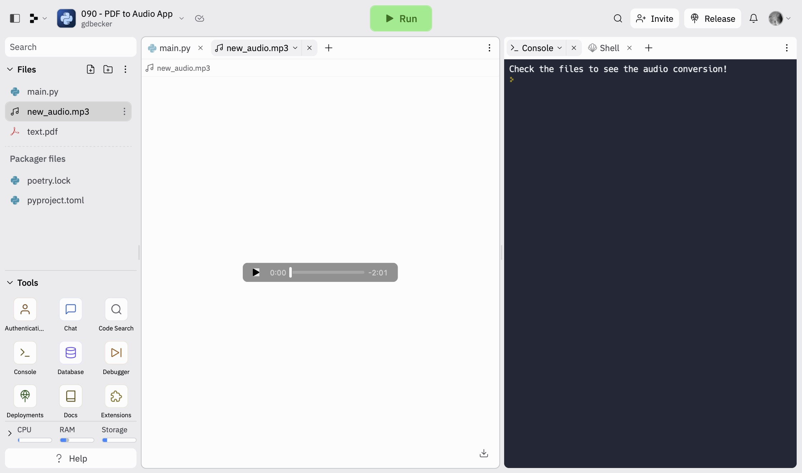

# 090 - PDF to Audio App

PDF to audio converter. Using API to transform text into an audio version

### Project Type

API

### Demo View

### Links

- [Live Demo](https://replit.com/@gdbecker/PDF-to-Audio-App)

### Tools & Packages

- [Python](https://www.python.org)
- requests
- PyPDF2
- [VS Code](https://code.visualstudio.com)

### Skills Used

- API connectivity
- Dictionaries
- Environment variables

## Author

- Website - [Garrett Becker]()
- Replit - [@gdbecker](https://replit.com/@gdbecker)
- LinkedIn - [Garrett Becker](https://www.linkedin.com/in/garrett-becker-923b4a106/)