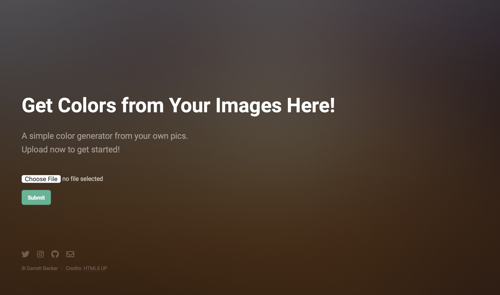

# 091 - Image Color Extractor App

Web app for showing top 10 colors in an uploaded image

### Project Type

Web Development

### Demo View

### Links

- [Live Demo](https://replit.com/@gdbecker/091-Image-Color-Extractor-App)

### Tools & Packages

- [Python](https://www.python.org)
- Flask
- flask-wtf
- wtforms
- Bootstrap
- HTML
- CSS
- webcolors
- [VS Code](https://code.visualstudio.com)

### Skills Used

- Flask web development framework
- Bootstrap framework
- Methods
- Decorators
- If statements
- Dictionaries
- try/except
- File handling
- Front-end web design
- REST architecture

## Author

- Website - [Garrett Becker]()
- Replit - [@gdbecker](https://replit.com/@gdbecker)
- LinkedIn - [Garrett Becker](https://www.linkedin.com/in/garrett-becker-923b4a106/)