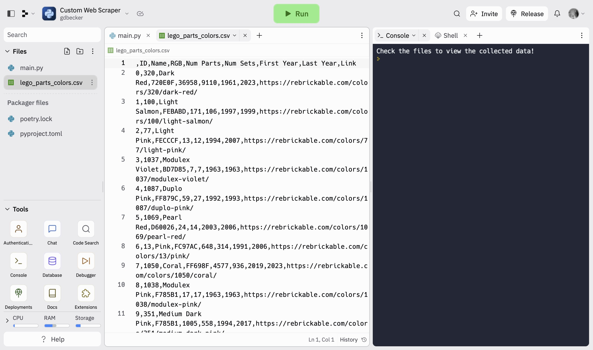

# 092 - Custom Web Scraper

Web scraper to grab LEGO parts and color data

### Project Type

Automation, Web Scraping

### Demo View

### Links

- [Live Demo](https://replit.com/@gdbecker/Custom-Web-Scraper)

### Tools & Packages

- [Python](https://www.python.org)
- requests
- bs4
- pandas
- [VS Code](https://code.visualstudio.com)

### Skills Used

- try/except
- Lists
- Dictionaries
- File handling

## Author

- Website - [Garrett Becker]()
- Replit - [@gdbecker](https://replit.com/@gdbecker)
- LinkedIn - [Garrett Becker](https://www.linkedin.com/in/garrett-becker-923b4a106/)