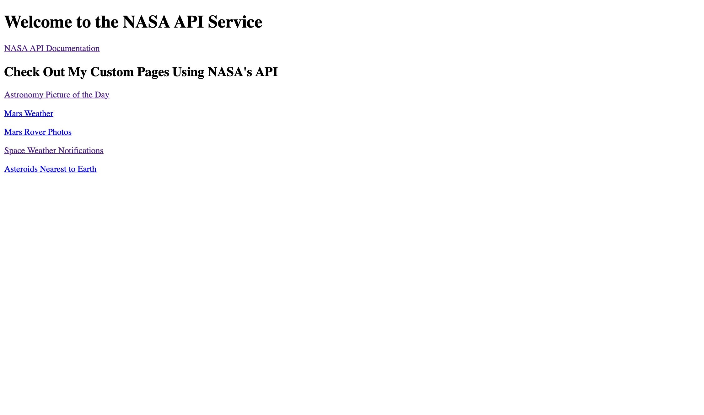

# 095 - NASA API Service

RESTful API service using public NASA API. [Source](https://api.nasa.gov/index.html)

### Project Type

API

### Demo View

### Links

- [Live Demo](https://replit.com/@gdbecker/NASA-API-Service)

### Tools & Packages

- [Python](https://www.python.org)
- Flask
- requests
- datetime
- HTML
- [VS Code](https://code.visualstudio.com)

### Skills Used

- Flask web development framework
- API connectivity
- Methods
- Decorators
- Dictionaries
- Front-end web design
- REST architecture
- Environment variables

## Author

- Website - [Garrett Becker]()
- Replit - [@gdbecker](https://replit.com/@gdbecker)
- LinkedIn - [Garrett Becker](https://www.linkedin.com/in/garrett-becker-923b4a106/)