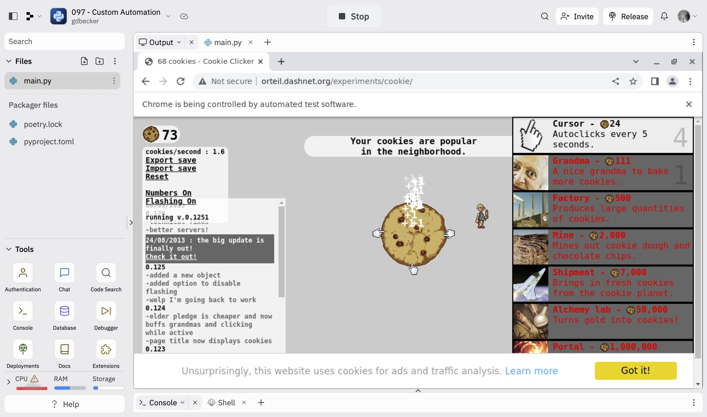

# 097 - Custom Automation

Automatically click the cookie with a bot using Selenium webdriver.

### Project Type

Automation

### Demo View

### Links

- [Live Demo](https://replit.com/@gdbecker/097-Custom-Automation)

### Tools & Packages

- [Python](https://www.python.org)
- selenium
- [VS Code](https://code.visualstudio.com)

### Skills Used

- Selenium web driver
- While loops
- If statements

### Other files in this folder

I have another Selenium project I made that automates adding books to read on Goodreads from a .csv file. Take a look! I don't have a live demo available because it's my personal account but I may add one for a dummy email address.

## Author

- Website - [Garrett Becker]()
- Replit - [@gdbecker](https://replit.com/@gdbecker)
- LinkedIn - [Garrett Becker](https://www.linkedin.com/in/garrett-becker-923b4a106/)