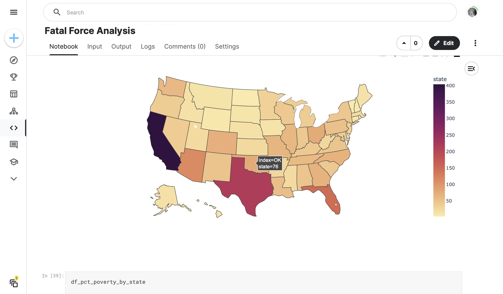

# 099 - Fatal Force Analysis

This analysis digs into the following datasets from Kaggle:
- [Fatal Police Shootings in the US](https://www.kaggle.com/datasets/abhi8923shriv/fatalpoliceshootingsintheus)
- [Percentage of People Below Poverty Level](https://www.kaggle.com/datasets/musti12/percentage-people-below-poverty-level) 
- [Police Killings in the US](https://www.kaggle.com/datasets/azizozmen/police-killings-us) 
- [Sharing Race by City](https://www.kaggle.com/datasets/musti12/sharing-race-by-city) 

Loads data in, cleans as necessary for NaN or null values, and explores the data via a series of questions.

### Project Type

Data Science

### Demo View

### Links

- [Live Demo](https://www.kaggle.com/code/garrettbecker/fatal-force-analysis/notebook)

## Tools Used

- Python
- Excel
- numpy
- pandas
- plotly
- matplotlib
- seaborn

## Author

- Website - [Garrett Becker]()
- Replit - [@gdbecker](https://replit.com/@gdbecker)
- LinkedIn - [Garrett Becker](https://www.linkedin.com/in/garrett-becker-923b4a106/)