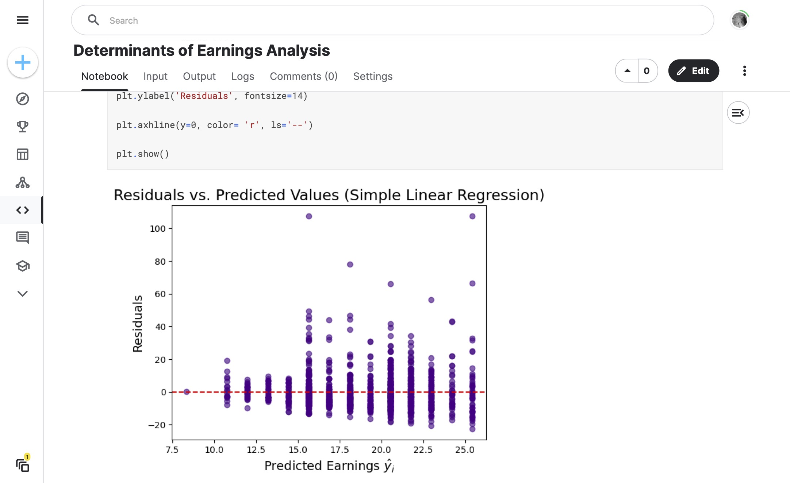

# 100 - Determinants of Earnings Analysis

This analysis digs into the [Determinants of Earnings Datasets](https://www.kaggle.com/datasets/garrettbecker/determinants-of-earnings-datasets) from Kaggle. Loads data in, cleans as necessary for NaN or null values, and explores the data via a series of questions.

### Project Type

Data Science

### Demo View

### Links

- [Live Demo](https://www.kaggle.com/code/garrettbecker/determinants-of-earnings-analysis/notebook)

## Tools Used

- Python
- Excel
- numpy
- pandas
- plotly
- matplotlib
- seaborn

## Author

- Website - [Garrett Becker]()
- Replit - [@gdbecker](https://replit.com/@gdbecker)
- LinkedIn - [Garrett Becker](https://www.linkedin.com/in/garrett-becker-923b4a106/)